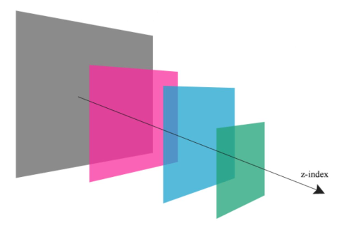

# Miro task 


## Project setup
* `Java 11`
* `Maven 3.6.3`
* `Spring Boot 2.3.4.RELEASE`
* `JUnit 5`

## Tests

```
$ mvn clean test integration-test
```

## Documentation

See [docs](docs/Miro_Take_Home_Test_(Java).pdf).

## API

### Widget model JSON
```
{
    "id": <string>, read-only
    "x": <integer>, required
    "y": <integer>, required
    "z": <integer>,
    "width": <double>, required
    "height": <double>, reqiured
    "lastModifiedAt": <timestamp>, read-only
}
```

### POST /widgets

Request:
```
{
    "x": <integer>, required
    "y": <integer>, required
    "z": <integer>,
    "width": <double>, required
    "height": <double>, reqiured
}
```

Response:
```
Widget
```

Create a widget. The server generates the identifier. If a z-index is not specified, the widget moves to the foreground. If the existing
z-index is specified, then the new widget shifts all widgets with the same and
greater index upwards. See [docs](docs/Miro_Take_Home_Test_(Java).pdf) for details.

### GET /widgets

Response:
```
[ Widget, ... ]
```

Read all widgets ordered by z-index from smallest to largest.

### GET /widgets/:id

Response:
```
Widget
```

Read widget by provided ID.

### PUT /widgets/:id

Request:
```
{
    "x": <integer>,
    "y": <integer>,
    "z": <integer>,
    "width": <double>,
    "height": <double>
}
```

Response:
```
Widget
```

Update widgets data. All changes to the widget occur atomically.

### DELETE /widgets/:id

Response:
```
Widget
```

Delete widget by provided ID.